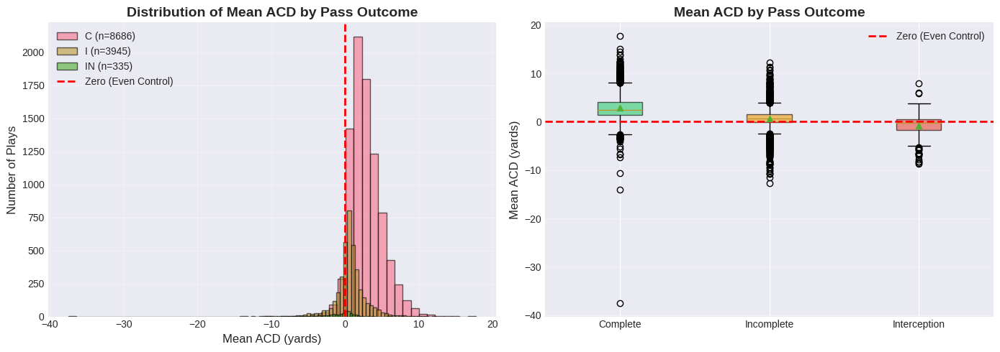
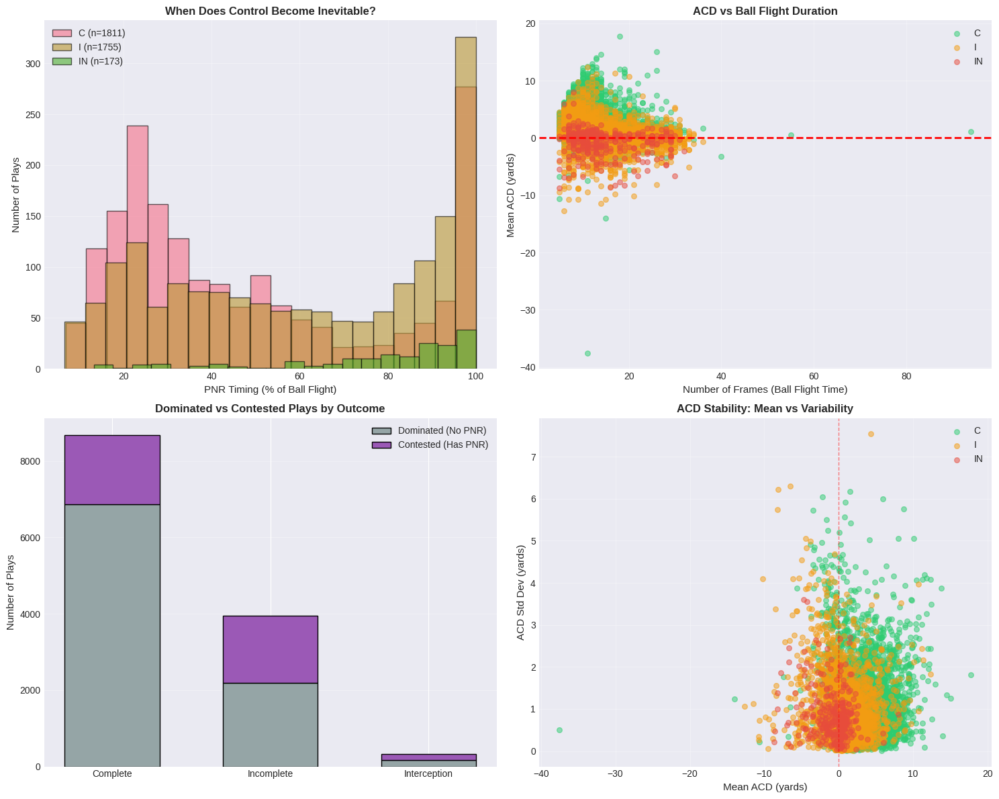
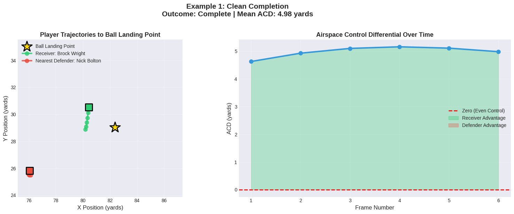
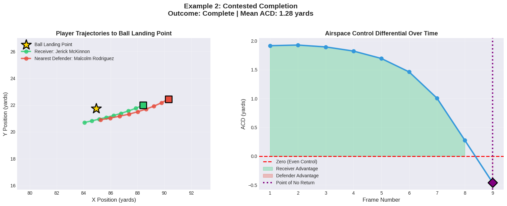
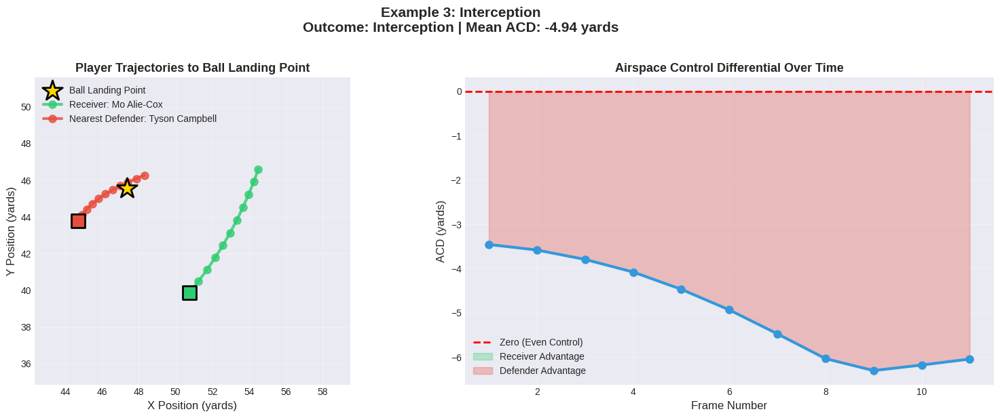
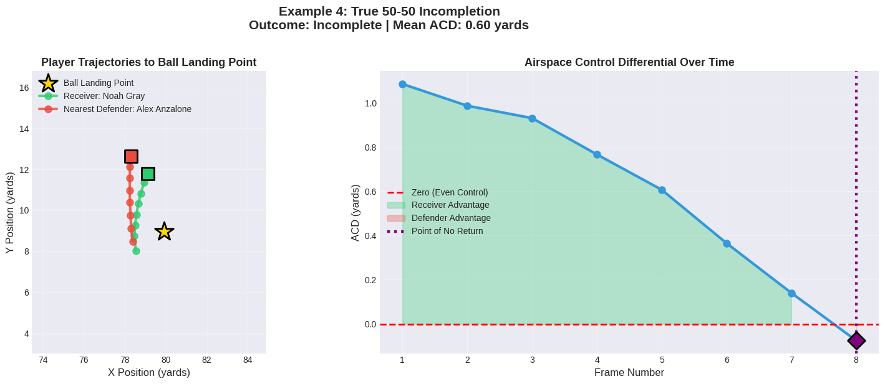
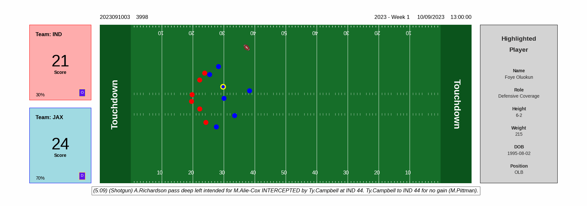

# 🏈 When Is a Catch Decided?
## Measuring Airspace Control on Downfield Passes

[](https://www.kaggle.com/competitions/nfl-big-data-bowl-2026-analytics)
[](https://www.python.org/)
[](https://pandas.pydata.org/)
[](https://jupyter.org/)

> **NFL Big Data Bowl 2026 - Analytics Track Submission**  
> *Author: Apoorv Pandey*

---

## 📊 Executive Summary

The downfield pass is often described as a **"50-50 ball"** — suggesting equal odds for offense and defense. But is that really true?

This analysis reveals that **71.2% of contested catches are decided well before the ball arrives**, using player tracking data to quantify who controls the airspace around the ball landing point.

### Key Findings

- **Completions**: Mean ACD = **+2.83 yards** (receiver advantage)
- **Incompletions**: Mean ACD = **+0.69 yards** (barely positive)  
- **Interceptions**: Mean ACD = **-0.80 yards** (defender advantage)
- **71% of plays** show no sign change in control (dominated throughout)
- **Only 29%** are truly contested with a measurable "Point of No Return"

---

## 🎯 The Core Metrics

### Airspace Control Differential (ACD)

At each frame after the ball is thrown, ACD measures the race to the ball landing point:

```
ACD(t) = d_defender(t) - d_receiver(t)
```

Where:
- **Positive ACD** → Receiver is closer (offensive advantage) ✅
- **Negative ACD** → Defender is closer (defensive advantage) ❌
- **ACD ≈ 0** → True contested catch ⚖️

### Point of No Return (PNR)

The earliest frame after the throw where airspace control **no longer changes hands**.

- **Early PNR** → Outcome decided by anticipation and positioning
- **Late PNR** → True athleticism battle down to the wire
- **No PNR** → One side dominated throughout (sign never changed)

---

## 📈 Visualizations

### Mean ACD by Pass Outcome



*Clear separation between completions (green), incompletions (orange), and interceptions (red)*

### Aggregate Analysis



*Four-panel analysis showing PNR timing, ACD vs flight duration, dominated vs contested plays, and ACD stability*

---

## 🎬 Example Plays

### 1. Clean Completion
**Mean ACD: +4.98 yards** | No PNR (Dominated)



*Receiver (Brock Wright) maintains consistent advantage throughout ball flight*

---

### 2. Contested Completion  
**Mean ACD: +1.28 yards** | PNR at Frame 9



*Jerick McKinnon starts ahead, defender closes late but receiver secures the catch*

---

### 3. Interception
**Mean ACD: -4.94 yards** | No PNR (Dominated)



*Defender (Tyson Campbell) controls airspace from first frame, receiver never gets close*

---

### 4. True 50-50 Incompletion
**Mean ACD: +0.60 yards** | PNR at Frame 8



*Truly contested — receiver advantage erodes as defender closes at the last moment*

---

## 🎥 Animations

### Contested Completion


*Watch how receiver maintains control despite late defensive pressure*

### Interception



*Defender dominates airspace throughout the play*

---

## 💡 Football Applications

### For Player Evaluation

**Receivers:**
- Measures ability to **attack the ball in flight**, not just pre-snap separation
- Elite receivers show early positive ACD (recognize trajectory fast)
- Quantifies performance on contested catches

**Defenders:**
- Captures **anticipation and closing efficiency**, not just raw speed
- Great DBs show negative ACD on interceptions from frame one
- Late PNR = excellent recovery burst

### For Coaching

- **71% of plays are dominated** → Focus on first-step explosiveness and ball recognition
- Early PNR completions → Teach receivers to break toward landing points sooner
- Late PNR interceptions → Emphasize reading QB eyes and closing angles

### For Broadcasting

- Replace subjective "50-50" calls with objective ACD metrics
- Show viewers when the outcome was actually decided
- Highlight defenders who make late plays vs. those who anticipated early

---

## 🛠️ Technical Implementation

### Data Sources

- **NFL Next Gen Stats** tracking data (2023 season, weeks 1-18)
- 18,009 plays analyzed
- 562,936 tracking frames (output data only)

### Dependencies

```python
pandas>=2.2.0
numpy>=1.26.0
matplotlib>=3.8.0
seaborn>=0.13.0
nfl-tracks>=1.0.0  # For enhanced visualizations
```

### Notebook Structure

1. **Data Loading** - Input/output tracking CSVs + supplementary data
2. **ACD Calculation** - Frame-by-frame distance computation
3. **PNR Detection** - Sign change analysis
4. **Outcome Analysis** - Statistical comparison by pass result
5. **Visualizations** - Example plays + aggregate insights
6. **Football Interpretation** - Practical applications

---

## 📂 Repository Structure

```
NFL-Big-Data-Bowl-2026---Analytics/
│
├── nfl-big-data-bowl-2026-analytics.ipynb    # Main analysis notebook
├── play_level_acd_summary.csv                # Play-level results
├── README.md                                  # This file
│
└── images/
    ├── mean_acd_by_pass_outcome.png          # Distribution plots
    ├── agg_analysis.png                      # Four-panel analysis
    ├── eg1.png                               # Example 1: Clean completion
    ├── eg2.png                               # Example 2: Contested completion
    ├── eg3.png                               # Example 3: Interception
    ├── eg4.png                               # Example 4: True 50-50
    ├── example_play_*_enhanced.png           # nfl-tracks visualizations
    ├── contested_completion_animation.gif     # Animation 1
    ├── interception_animation.gif            # Animation 2
    ├── contested_completion_animation.mp4    # MP4 version
    ├── interception_animation.mp4            # MP4 version
    └── writeup_thumbnail.png                 # Competition thumbnail
```

---

## 🚀 Running the Analysis

### On Kaggle (Recommended)

1. Fork this notebook on Kaggle
2. Attach the NFL Big Data Bowl 2026 Analytics dataset
3. Run all cells (execution time: ~8-10 minutes)

### Locally

1. Clone this repository:
```bash
git clone https://github.com/apoorvpandey048/NFL-Big-Data-Bowl-2026---Analytics.git
cd NFL-Big-Data-Bowl-2026---Analytics
```

2. Install dependencies:
```bash
pip install pandas numpy matplotlib seaborn nfl-tracks
```

3. Download competition data from Kaggle
4. Open and run `nfl-big-data-bowl-2026-analytics.ipynb`

---

## 🎓 Methodology Highlights

### What Makes This Analysis Strong

✅ **Focused Scope** - Analyzes only ball-in-air movement, not entire play  
✅ **Interpretable Metrics** - ACD and PNR are easy to explain to coaches  
✅ **Football Relevance** - Directly applicable to player evaluation and strategy  
✅ **Clear Visualizations** - Paired trajectory plots + ACD time series  
✅ **Honest Limitations** - Acknowledges vertical dimension and multi-defender scenarios

### Limitations & Future Work

- **Vertical dimension not captured** - No ball height or jump timing
- **Single defender simplification** - Uses only nearest defender
- **Static ball landing** - Assumes perfect knowledge (players estimate in real-time)

**Future extensions:**
- Incorporate ball trajectory data (height, velocity, hang time)
- Weight ACD by time remaining until arrival
- Account for player body positioning and orientation
- Analyze multi-defender scenarios and zone coverage

---

## 📊 Results Summary

### Play-Level Statistics

| Pass Result | Count | % of Plays | Mean ACD | Median ACD | Has PNR |
|-------------|-------|-----------|----------|------------|---------|
| Complete (C) | 8,686 | 67.0% | **+2.83** | +2.51 | 20.8% |
| Incomplete (I) | 3,945 | 30.4% | **+0.69** | +0.62 | 44.5% |
| Interception (IN) | 335 | 2.6% | **-0.80** | -0.20 | 51.6% |

### PNR Timing Analysis

| Outcome | % with PNR | Avg PNR Timing |
|---------|-----------|----------------|
| Completions | 20.8% | **48.7%** of ball flight |
| Incompletions | 44.5% | **61.1%** of ball flight |
| Interceptions | 51.6% | **78.1%** of ball flight |

---

## 🏆 Competition Details

- **Competition:** [NFL Big Data Bowl 2026 - Analytics](https://www.kaggle.com/competitions/nfl-big-data-bowl-2026-analytics)
- **Track:** University Track
- **Submission:** Kaggle Writeup with Public Notebook
- **Deadline:** December 17, 2025
- **Evaluation Criteria:**
  - Football Score (30%)
  - Data Science Score (30%)
  - Writeup Score (20%)
  - Data Visualization Score (20%)

---

## 📺 Media Gallery

All visualizations are available in the [`images/`](images/) directory and are included in the competition submission.

**YouTube Videos:**
- [Contested Completion Animation](https://youtube.com/...) - (https://youtu.be/KoBJXg0ojtM)
- [Interception Animation](https://youtube.com/...) - (https://youtu.be/9JY1xY6_B-8)

---

## 📝 Citation

If you use this analysis or methodology, please cite:

```bibtex
@misc{pandey2025airspacecontrol,
  author = {Pandey, Apoorv},
  title = {When Is a Catch Decided? Measuring Airspace Control on Downfield Passes},
  year = {2025},
  publisher = {Kaggle},
  howpublished = {\url{https://github.com/apoorvpandey048/NFL-Big-Data-Bowl-2026---Analytics}}
}
```

---

## 🙏 Acknowledgments

- **NFL** for providing Next Gen Stats tracking data
- **Kaggle** for hosting the Big Data Bowl competition
- **nfl-tracks** library creators for broadcast-quality visualizations
- NFL analytics community for inspiration and feedback

---

## 📧 Contact

**Apoorv Pandey**
- GitHub: [@apoorvpandey048](https://github.com/apoorvpandey048)
- Kaggle: [apoorvpandey048](https://www.kaggle.com/apoorvpandey048)

---

## 📜 License

This project is submitted for the NFL Big Data Bowl 2026 and follows the competition's terms and conditions. The NFL tracking data is used under the [Attribution-NonCommercial 4.0 International (CC BY-NC 4.0)](https://creativecommons.org/licenses/by-nc/4.0/) license.

---

<div align="center">

**⭐ If you find this analysis interesting, please star this repository! ⭐**

Made with ❤️ for the love of football and data science

</div>
